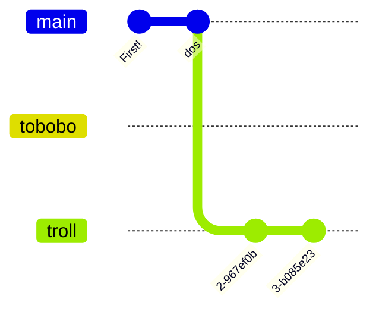

---
tags:
  - whr
  - guide
  - git
aliases:
  - west git guide
---
# What is this
`git` is a very powerful tool for dealing with multiple people working on the same code at once. Presumably if you have landed here you have already endured the ramblings of whoever is a veteran coder at the time so this primer will just be about the conceptual how, not the why.

Here in WHR we only usually use a very small subset of `git` cause we don't need all of it. If you end up finding the need to do/fix more then talk to the `git` person (at the time of writing man ming).

> [!info]- For experienced git users
> People will inevitably dump everything into one giga commit and almost everything just stays on `master` (not `main` cause upstream L). Branches are rarely used because dealing with that complexity is not worth it for most teams.
> 
> If you are comfortable with `git` I highly recommend going off to your own branch and treating that as main. Branching based off subject is not idiomatic, but this way your opmodes are not cluttered with everyone else's and it makes integration of things that sit in `teamcode` like the Roadrunner quickstart slightly easier.
> 
> Why are all the teams sharing one repo? To make it easier to onboard, help people, and share code.
> Also, when you update stuff like the SDK, please push it back up to `master` and tell everyone to pull.

# Commits
Internally, `git` stores everything as a big stack of changes all piled up on each other. 1 commit = 1 set of changes. You can only move around in time in units of commits.

